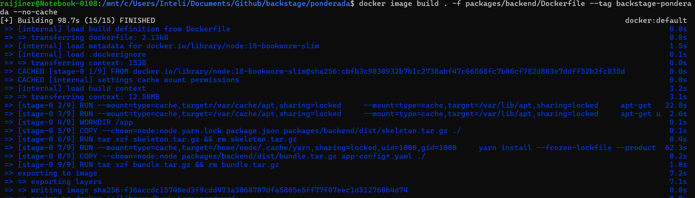
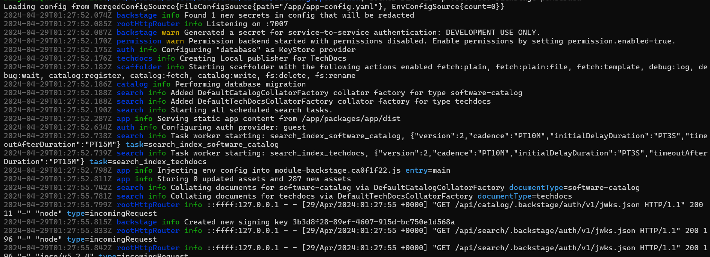
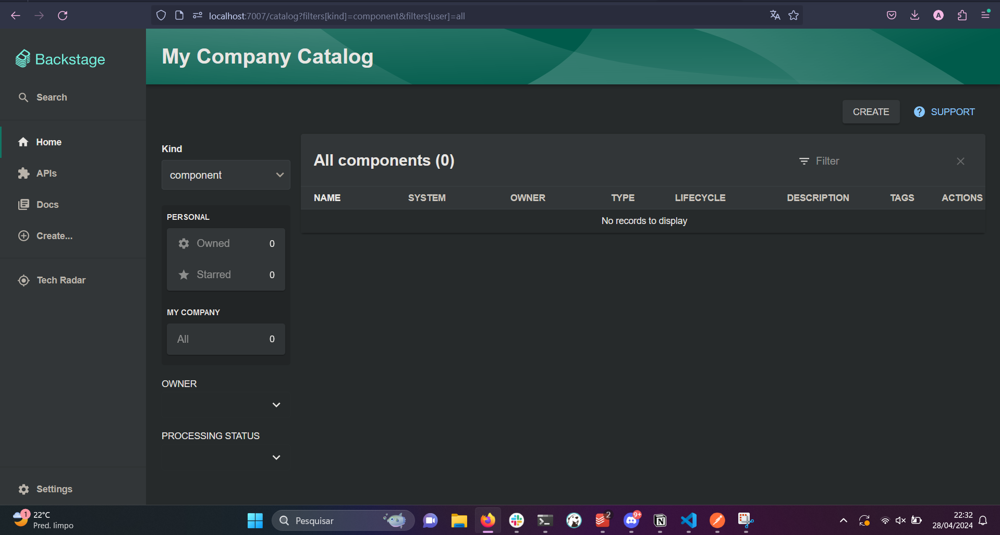

# Compilação e Execução do Backstage com Docker

Aqui está um guia passo a passo para compilar e executar o Backstage utilizando Docker, seguindo os guias oficiais disponíveis em [Getting Started](https://backstage.io/docs/getting-started/) e [Docker Deployment](https://backstage.io/docs/deployment/docker/).

## Instalar o Backstage

1. Clone o repositório do Backstage:
    ```bash
    git clone https://github.com/backstage/backstage.git
    ```

2. Navegue até o diretório da aplicação e instale as dependências:
    ```bash
    yarn install
    ```

3. Caso o Yarn esteja desatualizado, execute:
    ```bash
    npm install --global yarn
    ```

## Preparar o Build do Backstage

1. Instale as dependências sem atualizar o lockfile:
    ```bash
    yarn install --frozen-lockfile
    ```

2. Prepare os types do Backstage:
    ```bash
    yarn tsc
    ```

3. Build a aplicação:
    ```bash
    yarn build:backend
    ```

## Compilar e Executar no Docker

1. Execute o seguinte comando para compilar a imagem Docker do Backstage:
    ```bash
    docker image build . -f packages/backend/Dockerfile --tag backstage --no-cache
    ```




2. Após a conclusão da compilação, execute o contêiner Docker:
    ```bash
    docker run -it -p 7007:7007 backstage
    ```



## Acessar o Backstage

Abra um navegador da web e acesse o seguinte URL para acessar o Backstage: http://localhost:7007

# ponderada-backstage
# ponderada-backstage
